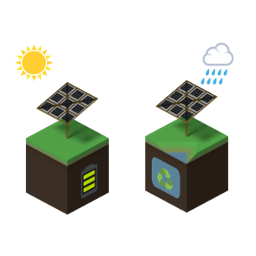

title:  achtergrond

Over Jaar Salo
==============

Jaar Salo speelt in op een groeiende behoefte in de maatschappij naar duurzaamheid. Binnen deze behoefte geven wij zelfvoorziening en het zelf kunnen realiseren een significante rol. Zelfvoorzienend wonen en zelf bouwen levert onafhankelijkheid en vrijheid op. Wij ontwikkelen off-grid mogelijkheden voor woningen en gemeenschappen, uitgerust met alle moderne gemakken. 

Het zelf voorzien in basisbenodigdheden brengt een nieuwe bewustwording op gang. Een zelfvoorzienende woning heeft een aantal praktische bijkomstigheden. Sommige daarvan zijn eenvoudiger op te lossen in collectiviteit en verbondenheid. Bijvoorbeeld de opslag van energie of het reinigen van water. Het Jaar Salo concept houdt rekening met zowel individuele behoeften als voordelen van gemeenschappelijkheid. We maken daarom gebruik van modulaire oplossingen die te koppelen zijn. Hiermee biedt Jaar Salo de mogelijkheid tot decentralisatie en de ontwikkeling van kleinschalige gemeenschappen.

Duurzaamheid kent vele gezichten. Klimaatvraagstukken maken veel los, ook in de wereld van de technologie. Helaas is technologie niet altijd even inzichtelijk en toegankelijk.
Voor Jaar Salo is het wezenlijk dat technologie eenvoudig toepasbaar is en volledig toegankelijk en open source. Daarmee kan iedereen een rol vervullen in verdere ontwikkeling.

Het zelf kunnen bouwen en toepassen van de ontwikkelde principes is een uitgangspunt van Jaar Salo. Bouwmethoden dienen eenvoudig, inzichtelijk en multifunctioneel inzetbaar te zijn.
Nieuwe technologie wordt ingezet zowel bij het bouwproces als bij het gebruik. Hierbij zoeken wij naar modulaire oplossingen, zodat de principes schakelbaar en uitbreidbaar zijn.

Jaar Salo wil een schakel zijn in de ontwikkeling van nieuwe samenlevingsvormen.
Zelfvoorzienendheid bij kleinere of grotere gemeenschappen is daarin een belangrijke factor.
We streven naar optimale ruimte voor individuele ontwikkeling, maar binnen een sociaal en collectief kader.

De volgende principes worden gehanteerd voor realisatie:

* off grid - volledig zelfstandig en los van bestaande netwerken
* open source - alle toegepaste kennis en techniek is openbaar
* sustainable - duurzaam zowel in fabricage als gebruik
* modulair - basisunit met diverse uitbreidingsmogelijkheden
